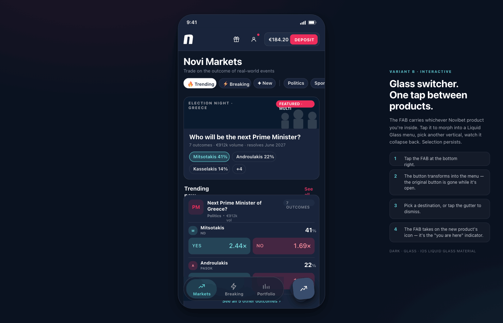

# Vertical Switcher FAB - Angular Library

This repository contains the **Vertical Switcher FAB** Angular library, an iOS Liquid Glass-style Floating Action Button component for product/app switching.

## 📸 Preview

<div align="center">



*iOS Liquid Glass-style FAB with smooth animations and backdrop blur*

</div>

## 📦 Package

This is a monorepo containing:
- **Library**: `projects/vertical-switcher-fab` - The reusable Angular library
- **Demo**: `projects/demo` - Demo application showcasing the library

## 🚀 Getting Started

### Prerequisites

- Node.js 18+ (LTS recommended)
- Angular CLI 20+
- npm or yarn

### Installation

```bash
# Clone the repository
git clone <repository-url>
cd ng-vertical-switcher-fab

# Install dependencies
npm install
```

### Build the Library

```bash
ng build vertical-switcher-fab
```

The built library will be in `dist/vertical-switcher-fab`.

### Run the Demo

```bash
ng serve demo
```

Navigate to `http://localhost:4200/` to see the demo application.

## 📚 Library Documentation

See the [Library README](projects/vertical-switcher-fab/README.md) for:
- Installation instructions
- API reference
- Usage examples
- Customization options

## 🎨 Design

The library implements a "Glass Switcher" FAB design inspired by:
- **iOS Liquid Glass** material design
- Modern mobile app interfaces
- Contemporary design patterns

### Key Features

- **Glass Variant**: iOS-style liquid glass with backdrop blur
- **Solid Variant**: Material design-inspired style
- **Morphing Animations**: Smooth spring-based transitions
- **Toast Notifications**: Built-in switch notifications
- **Keyboard Accessible**: Full ARIA support and ESC key handling
- **Responsive**: Optimized for mobile and desktop

## 🏗️ Project Structure

```
ng-vertical-switcher-fab/
├── projects/
│   ├── vertical-switcher-fab/       # Library source
│   │   ├── src/
│   │   │   ├── lib/
│   │   │   │   ├── components/      # FAB components
│   │   │   │   ├── models/          # TypeScript interfaces
│   │   │   │   └── styles/          # SCSS tokens & animations
│   │   │   └── public-api.ts        # Public exports
│   │   └── README.md                # Library documentation
│   └── demo/                        # Demo application
│       └── src/
│           └── app/                 # Demo app components
├── dist/                            # Build output
├── node_modules/                    # Dependencies
└── README.md                        # This file
```

## 🛠️ Development

### Build Commands

```bash
# Build library only
ng build vertical-switcher-fab

# Build demo only
ng build demo
```

### Development Server

```bash
# Serve demo app
ng serve demo

# Serve with live reload
ng serve demo --watch
```

### Testing

```bash
# Run tests
ng test vertical-switcher-fab
```

## 📝 Design Implementation

The library implements the design from `floating-vertical-selector/` handoff bundle:

### Components Implemented

1. **FabComponent** - Main FAB button with coaster layers
2. **FabMenuComponent** - Popup menu (glass or solid variants)
3. **FabItemComponent** - Individual menu items
4. **ToastComponent** - Switch notification toast

### Design Specifications Followed

- **Colors**: Modern color palette (cyan #5DD5D7, pink #EE2D5C, gold #F2B73B)
- **Typography**: Manrope (body), Space Grotesk (display)
- **Radii**: iOS-inspired rounded corners (18px for glass, 999px for solid)
- **Animations**: Spring physics with cubic-bezier easing
- **Blur Effects**: 28px blur with 180% saturation for glass surfaces

## 🎯 Browser Support

- Chrome/Edge: ✅ Latest 2 versions
- Firefox: ✅ Latest 2 versions
- Safari: ✅ Latest 2 versions
- iOS Safari: ✅ 14+
- Android Chrome: ✅ Latest 2 versions

**Note**: Backdrop filter effects require modern browser support.

## 📄 License

MIT License - See LICENSE file for details.

## 🤝 Contributing

Contributions are welcome! Please:

1. Fork the repository
2. Create a feature branch
3. Make your changes
4. Submit a pull request

## 📧 Support

For issues or questions:
- Open an issue on GitHub
- Check the [Library README](projects/vertical-switcher-fab/README.md) for documentation

## 🙏 Credits

- **Design Inspiration**: iOS Liquid Glass material design
- **Framework**: Angular 20+
- **Build Tool**: Angular CLI with ng-packagr

---

Built with ❤️ using Angular
