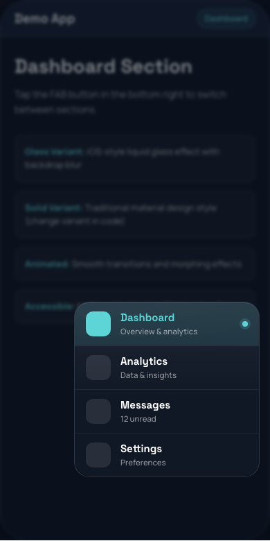
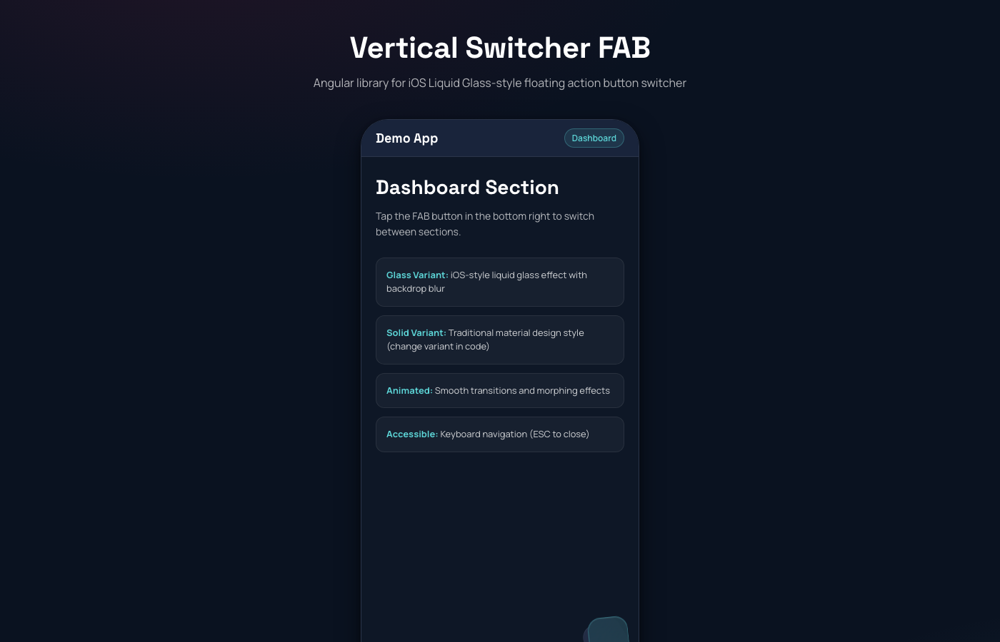
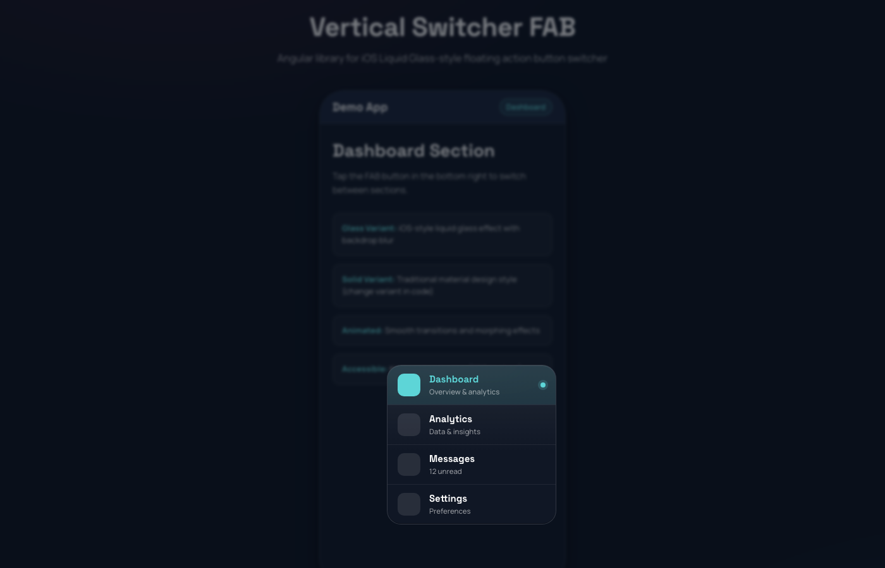

# Vertical Switcher FAB

An Angular 20+ library featuring an iOS Liquid Glass-style Floating Action Button (FAB) for seamless app section switching.


## 📸 Screenshots

<div align="center">

### Demo Application



*Phone mockup showing the FAB in a modern app interface*

<br/>

### FAB States

<table>
<tr>
<td align="center">

<br/>
<em>Default state with FAB button</em>
</td>
</tr>
<tr>
<td align="center">

<br/>
<em>Menu expanded with glass effect</em>
</td>
</tr>
</table>

</div>

## Features

- ✨ **Glass Variant**: iOS-style liquid glass effect with backdrop blur
- 🎨 **Solid Variant**: Traditional material design style
- 🎭 **Smooth Animations**: Morphing transitions and spring physics
- ⌨️ **Keyboard Accessible**: ESC key support and ARIA labels
- 📱 **Mobile-Ready**: Optimized for touch interactions
- 🎯 **Toast Notifications**: Built-in section switch notifications
- 🌓 **Theme Support**: Dark and light theme compatible
- 🔧 **Highly Customizable**: Position, variant, and styling options

## Installation

```bash
npm install vertical-switcher-fab
```

## Quick Start

### 1. Import the Component

```typescript
import { Component } from '@angular/core';
import { FabComponent, FabItem } from 'vertical-switcher-fab';

@Component({
  selector: 'app-root',
  imports: [FabComponent],
  template: `
    <vsf-fab
      [items]="fabItems"
      [variant]="'glass'"
      [position]="'right'"
      [currentProductId]="currentProductId"
      (productChange)="onProductChange($event)"
    ></vsf-fab>
  `
})
export class AppComponent {
  currentProductId = 'dashboard';

  fabItems: FabItem[] = [
    {
      id: 'dashboard',
      label: 'Dashboard',
      sub: 'Overview & analytics',
      tone: 'cyan',
      icon: '<svg>...</svg>',
      current: true
    },
    {
      id: 'analytics',
      label: 'Analytics',
      sub: 'Data & insights',
      tone: 'violet',
      icon: '<svg>...</svg>'
    }
  ];

  onProductChange(item: FabItem) {
    this.currentProductId = item.id;
  }
}
```

### 2. Add Styles

Import the library styles in your global `styles.scss`:

```scss
@import 'vertical-switcher-fab/styles/tokens';
@import 'vertical-switcher-fab/styles/animations';
```

Or include the required fonts in your `index.html`:

```html
<link href="https://fonts.googleapis.com/css2?family=Manrope:wght@400;500;600;700;800&family=Space+Grotesk:wght@500;600;700&display=swap" rel="stylesheet" />
```

## API Reference

### FabComponent

#### Inputs

| Property | Type | Default | Description |
|----------|------|---------|-------------|
| `items` | `FabItem[]` | `[]` | Array of section items to display |
| `variant` | `'solid' \| 'glass'` | `'glass'` | Visual style variant |
| `position` | `'left' \| 'right'` | `'right'` | FAB position on screen |
| `currentProductId` | `string` | `undefined` | ID of currently active section |
| `showToast` | `boolean` | `true` | Whether to show toast notifications on switch |
| `toastPosition` | `'top' \| 'center' \| 'bottom'` | `'center'` | Position of toast notification |

#### Outputs

| Event | Type | Description |
|-------|------|-------------|
| `productChange` | `EventEmitter<FabItem>` | Emitted when user selects a different section |

### FabItem Interface

```typescript
interface FabItem {
  id: string;              // Unique identifier
  label: string;           // Display label
  sub?: string;            // Subtitle/description
  tone: 'pink' | 'gold' | 'cyan' | 'violet' | 'neutral'; // Color theme
  icon: string;            // SVG content as string
  current?: boolean;       // Whether this is the current item
}
```

## Variants

### Glass Variant (Default)

The glass variant features:
- iOS-style liquid glass effect with backdrop blur
- Unified card with hairline dividers
- Morphing animation where FAB transforms into menu
- Stacked "coaster" layers for depth

```html
<vsf-fab [variant]="'glass'" [items]="items"></vsf-fab>
```

### Solid Variant

The solid variant features:
- Material design-inspired pills
- Distinct card shadows
- Corner badge indicator
- Traditional expand/collapse animation

```html
<vsf-fab [variant]="'solid'" [items]="items"></vsf-fab>
```

## Customization

### CSS Custom Properties

Override these CSS variables to customize the appearance:

```scss
:root {
  // Brand colors
  --vsf-cyan: #5dd5d7;
  --vsf-pink: #ee2d5c;
  --vsf-gold: #f2b73b;
  --vsf-violet: #7c5cff;

  // Surfaces
  --vsf-bg: #0e1726;
  --vsf-surface: #19243b;
  --vsf-ink: #ffffff;

  // Radii
  --vsf-r-md: 10px;
  --vsf-r-lg: 14px;
  --vsf-r-xl: 22px;

  // Typography
  --vsf-ff-body: 'Manrope', sans-serif;
  --vsf-ff-display: 'Space Grotesk', sans-serif;
}
```

### Position

Place the FAB on the left or right:

```html
<vsf-fab [position]="'left'" [items]="items"></vsf-fab>
<vsf-fab [position]="'right'" [items]="items"></vsf-fab>
```

### Toast Position

Control where the switch notification appears:

```html
<vsf-fab [toastPosition]="'top'" [items]="items"></vsf-fab>
<vsf-fab [toastPosition]="'center'" [items]="items"></vsf-fab>
<vsf-fab [toastPosition]="'bottom'" [items]="items"></vsf-fab>
```

### Disable Toast

Turn off switch notifications:

```html
<vsf-fab [showToast]="false" [items]="items"></vsf-fab>
```

## Icon Format

Icons should be provided as SVG strings. Example:

```typescript
const icon = `<svg width="22" height="22" viewBox="0 0 24 24" fill="none" stroke="currentColor" stroke-width="1.8">
  <path d="M3 17l6-6 4 4 8-9" />
  <path d="M14 6h7v7" />
</svg>`;
```

For a comprehensive icon guide with ready-to-use examples, see [ICON_GUIDE.md](../../ICON_GUIDE.md).

## Accessibility

The component includes:
- ARIA labels for screen readers
- Keyboard navigation (ESC to close)
- Focus management
- Semantic HTML structure

## Browser Support

- Chrome/Edge: Latest 2 versions
- Firefox: Latest 2 versions
- Safari: Latest 2 versions
- iOS Safari: 14+
- Android Chrome: Latest 2 versions

**Note**: Backdrop filter effects require modern browser support.

## Design Credits

Design inspired by iOS Liquid Glass material design patterns and modern mobile app interfaces.

## License

MIT License - See LICENSE file for details

## Contributing

Contributions are welcome! Please open an issue or submit a pull request.

## Development

```bash
# Install dependencies
npm install

# Build library
npm run build vertical-switcher-fab

# Build demo
npm run build demo

# Serve demo
ng serve demo
```

## Support

For issues, questions, or suggestions, please open an issue on GitHub.
